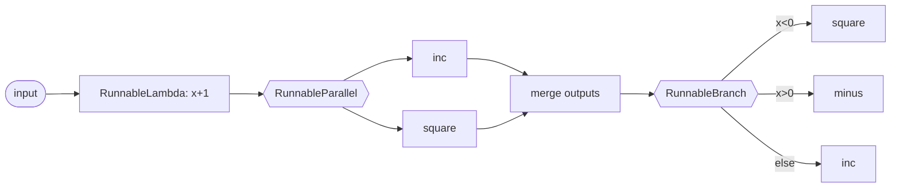

# P1 강의 자료

## 핵심 개념 정리
- @1일차.md (21-26) PromptTemplate/ChatPromptTemplate는 LLM 호출 전에 “질문 틀”을 정의하고, `{변수}`나 `MessagesPlaceholder`로 자리만 남긴 뒤 실행 시 값을 채워 넣는다. 재사용성과 일관된 톤·포맷을 보장하기 위한 전처리 단계다.
- @1일차.md (34-37) OutputParser(Json/Pydantic)는 “LLM이 어떤 형태로 답해야 하는지”를 프롬프트에 명시하고, 응답을 원하는 스키마로 검증·파싱해 자연어 대신 구조화 데이터를 받는다.
- Runnable 체인 패턴: `RunnableLambda`로 작업 단위를 만들고 `RunnableSequence`(직렬), `RunnableParallel`(병렬 분기), `RunnableBranch`(조건 분기)로 조합한다. 체인은 입력→(전처리/프롬프트)→LLM→(후처리/검증)처럼 단계별로 합성하는 파이프라인 개념이며, 병렬·조건 결합으로 데이터 전처리, LLM 호출, 결과 파싱을 하나의 실행 그래프로 묶을 수 있다.

## 개요 및 실행 준비
- LangChain 입문에서 프롬프트, 체인, 출력 파서, 외부 모델 연동까지 단계별 실습을 다룹니다.
- Python 실행은 가상환경을 권장합니다(Windows 예시: `python -m venv .venv && .venv\Scripts\activate` 후 `pip install -r requirements.txt` 형태로 설치).
- 예제들은 `.env`에 필요한 키(예: `GOOGLE_API_KEY`, `HUGGINGFACEHUB_API_TOKEN`)를 넣고 `python-dotenv`로 불러옵니다.

## 1) LLM 초기화와 단일 호출 (P1-1)
- `init_chat_model`로 Google Gemini 모델을 바로 호출하고 단일 질문을 `invoke`로 처리합니다.
- 질문을 바꿔가며 환각(Hallucination) 여부와 프롬프트 엔지니어링 효과를 확인합니다.

```1:14:P1/1-llm.py
import dotenv
from langchain.chat_models import init_chat_model
llm = init_chat_model("gemini-robotics-er-1.5-preview", model_provider="google_genai")
response = llm.invoke(message)
print(response)
```

## 2) Runnable과 체인 패턴 (P1-2)
- `RunnableLambda`로 단일 연산을 만들고 `invoke`와 `batch`로 동기·배치 실행을 실습합니다.
- `RunnableSequence`로 직렬 파이프라인, `RunnableParallel`로 병렬 분기, `RunnableBranch`로 조건 분기를 구성합니다.

```1:26:P1/2-lcel.py
r = RunnableLambda(lambda x: x + 1)
result = r.batch([1, 2, 3])
minus = RunnableLambda(lambda x: x-1)
inc = RunnableLambda(lambda x: x+1)
square = RunnableLambda(lambda x: x*x)
chain2 = RunnableSequence(inc, RunnableParallel(increased=inc, squared=square))
print(chain2.invoke(1))
```

```29:37:P1/2-lcel.py
b = RunnableBranch(
    (lambda x: x<0, square),
    (lambda x: x>0, minus),
    inc
)
print(b.invoke(-2))
```

머메이드 UML로 흐름을 정리하면 다음과 같습니다.



직렬(`Sequence`)은 앞 단계 출력을 그대로 다음 단계 입력으로 넘기고, 병렬(`Parallel`)은 동일 입력을 여러 경로로 복제한 뒤 dict로 합칩니다. 분기(`Branch`)는 조건을 만족하는 첫 경로만 실행합니다. 이 조합으로 “전처리 → LLM 호출 → 후처리/검증”을 하나의 실행 그래프로 구성할 수 있습니다.

## 3) PromptTemplate 활용 (P1-4)
- `{country}` 등 플레이스홀더를 가진 템플릿으로 질문을 생성하고, `partial`로 날짜 등 공통 값을 주입합니다.
- `prompt | llm` 체인으로 템플릿 → 모델 호출 흐름을 구성합니다.

```1:30:P1/4-prompt.py
prompt = PromptTemplate.from_template("{country}의 수도는?")
result = prompt.invoke({"country": "한국"})
prompt = prompt.partial(date=datetime.now().strftime("%m월 %d일"))
chain = prompt | llm
result = chain.invoke({"date": "3월 11일", "count": 10})
```

## 4) ChatPromptTemplate와 메시지 히스토리 (P1-5)
- 역할(role)별 메시지 목록으로 대화 프롬프트를 정의하고, `MessagesPlaceholder`로 이전 대화를 주입합니다.
- 요약 프롬프트 예시처럼 히스토리를 받아 후처리하는 체인을 실습합니다.

```1:37:P1/5-chat-prompt.py
prompt = ChatPromptTemplate.from_messages([
    ("system", "당신은 친절한 AI 어시스턴트입니다. 당신의 이름은 {name} 입니다."),
    ("human", "반가워요!"),
    ("ai", "안녕하세요! 무엇을 도와드릴까요?"),
    ("human", "{user_input}"),
])
prompt2 = ChatPromptTemplate.from_messages([
    ("system", "당신은 대화 내용을 요악해주는 도우미입니다."),
    MessagesPlaceholder(variable_name="history"),
    ("human", "대화 내용을 요약해 주세요.")
])
chain2 = prompt2 | llm
print(chain2.invoke({"history": [...] }))
```

## 5) 프롬프트 저장·공유 (P1-6)
- `PromptTemplate.save()`로 JSON/YAML로 저장하고, `hub.pull`/`hub.push`로 LangChain Hub에 공유합니다.
- Hub 사용 시 LangSmith API 키가 필요합니다.

```1:21:P1/6-prompt-hub.py
from langchain import hub
prompt = hub.pull("rlm/rag-prompt")
prompt_owner = "bosornd"
prompt_title = "rag-prompt"
hub.push(f"{prompt_owner}/{prompt_title}", prompt)
```

## 6) 출력 포맷 강제: Pydantic/JSON 파서 (P1-7)
- `PydanticOutputParser` 또는 `JsonOutputParser`로 LLM 응답을 구조화합니다.
- `get_format_instructions()`를 템플릿에 삽입해 모델이 지정된 스키마를 따르도록 안내합니다.

```1:27:P1/7-output.py
class ResponseModel(BaseModel):
    country: str = Field(description="The name of the country")
    capital: str = Field(description="The Capital City of the country")
output_parser = JsonOutputParser(pydantic_object=ResponseModel)
prompt = PromptTemplate.from_template("{country}의 수도는?\n{format}")
prompt = prompt.partial(format=output_parser.get_format_instructions())
chain = prompt | llm | output_parser
response = chain.invoke({"country": "중국"})
```

## 7) DatetimeOutputParser (P1-8)
- 날짜/시간 포맷을 강제할 때 사용하며, 포맷 지침을 프롬프트에 삽입 후 체인에 연결합니다.

```4:17:P1/8-datetime-output.py
output_parser = DatetimeOutputParser()
prompt = PromptTemplate.from_template("{company}의 창립기념일은?\n{format}")
prompt = prompt.partial(format=output_parser.get_format_instructions())
chain = prompt | llm | output_parser
response = chain.invoke({"company": "Google"})
```

## 8) EnumOutputParser (P1-9)
- 미리 정의한 Enum 값만 허용하도록 응답을 제한합니다.

```4:25:P1/9-enum-output.py
class Color(Enum):
    RED    = "빨강"
    BLUE   = "파랑"
    YELLOW = "노랑"
output_parser = EnumOutputParser(enum=Color)
prompt = PromptTemplate.from_template("{product}의 색상은?\n{format}")
prompt = prompt.partial(format=output_parser.get_format_instructions())
chain = prompt | llm | output_parser
response = chain.invoke({"product": "물"})
```

## 9) Gemini API 활용 확장 (P1-10, P1-1)
- `ChatGoogleGenerativeAI` 클래스로 모델을 직접 지정합니다.
- Google GenAI 클라이언트로 파일 캐시를 만들고(`client.caches.create`) LLM 호출 시 `cached_content`로 재사용할 수 있습니다.
- 이미지 업로드 후 텍스트와 함께 멀티모달 질의도 가능합니다.

```1:5:P1/10-gemini.py
from langchain_google_genai import ChatGoogleGenerativeAI
llm = ChatGoogleGenerativeAI(model="gemini-robotics-er-1.5-preview")
```

```284:320:P1/P1.md
client = genai.Client()
cache = client.caches.create(model='gemini-robotics-er-1.5-preview', ...)
llm = ChatGoogleGenerativeAI(model='gemini-robotics-er-1.5-preview', cached_content=cache.name)
image = client.files.upload(file="../data/일출.jpg")
response = client.models.generate_content(model='gemini-robotics-er-1.5-preview', contents=[image, '사진에 대해 설명해줘'])
```

## 10) HuggingFace 모델 호출 (P1-11)
- 허깅페이스 토큰으로 로그인 후 `HuggingFacePipeline.from_model_id`로 텍스트 생성 파이프라인을 구성합니다.

```8:15:P1/11-huggingface.py
from langchain_huggingface import HuggingFacePipeline
llm = HuggingFacePipeline.from_model_id(
    model_id="rombodawg/Rombos-LLM-V2.5-Qwen-32b",
    task="text-generation",
)
response = llm.invoke("한국의 수도는?")
```

## 11) 대화 히스토리 관리 챗봇 (P1-12)
- `ChatPromptTemplate`와 `RunnableWithMessageHistory`를 결합해 세션별 히스토리를 자동으로 관리합니다.
- 세션 ID별 `InMemoryChatMessageHistory`를 유지해 멀티 세션 대화를 지원합니다.

```13:65:P1/12-chat.py
prompt = ChatPromptTemplate.from_messages([
    ("system", "당신은 나의 아들이고, 10살이며 한국에사는 초등학교 3학년 학생입니다..."),
    MessagesPlaceholder(variable_name="history"),
    ("human", "{user_input}"),
])
chain = RunnableWithMessageHistory(
    prompt | llm,
    get_session_history,
    input_messages_key="user_input",
    history_messages_key="history",
)
response = chain.invoke({"user_input": "안녕"}, config={"configurable": {"session_id": "cli"}})
```

## 실습 아이디어 (각 섹션 T1~T5)
- LLM 질문을 변형해 환각 여부를 관찰하고, 근거 문맥을 추가해 개선해 보기.
- Runnable 조합을 바꿔 병렬/분기 흐름을 스케치하고, 메르메이드로 시각화하기.
- PromptTemplate/ChatPromptTemplate에 `partial` 값과 `MessagesPlaceholder`를 섞어 재사용성 높은 템플릿 만들기.
- OutputParser를 Pydantic/Datetime/Enum으로 바꿔가며 유효성 실패 케이스를 실험하기.
- Hub에 본인이 만든 프롬프트를 업로드하고, 다른 세션에서 `hub.pull`로 재사용해 보기.
- RunnableWithMessageHistory에 영속 스토리지를 연결해 다중 사용자 세션 지원하기.

## 참고 링크
- LangChain API 레퍼런스: https://python.langchain.com/api_reference
- Gemini 모델 목록: https://ai.google.dev/gemini-api/docs/models
- HuggingFace 모델 허브: https://huggingface.co

