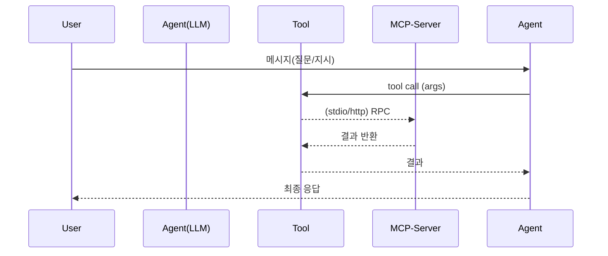

# P3 강의 자료 (Tools · Agents · MCP)

## 핵심 개념 정리
- Tool 정의: `@tool(parse_docstring=True)`로 구글 스타일 docstring을 파싱해 인자 스키마와 설명을 자동 생성하고, LLM에 안전한 호출 인터페이스를 제공한다(`P3/1-tool.py`).
- Runnable/Chain as Tool: 임의의 `RunnableLambda`나 프롬프트·LLM 체인을 `as_tool()`로 감싸 재사용 가능한 도구로 노출한다(`P3.md` P3-1).
- 내장/외부 도구: Wikipedia 등 기본 제공 도구를 그대로 호출하거나 메타데이터를 확인하여 프롬프트에 반영한다(`P3/2-wikipedia.py`).
- REPL 실행 도구: `PythonREPLTool`을 통해 모델이 작성한 코드를 실행하고 결과를 파이프라인에 연결해 문제 해결형 에이전트를 구성한다(`P3.md` P3-3).
- 날짜·유틸 도구와 Tool Calling Agent: 간단한 함수형 툴을 LLM에 바인딩해 다단계 계산/조회 흐름을 자동화한다(`P3/4-date.py`, `P3/1-tool.py` 마지막 예제).
- MCP: 모델 컨텍스트 프로토콜로 외부 프로세스를 도구 서버로 노출하고, `MultiServerMCPClient`와 에이전트가 이 도구들을 불러 사용한다(`P3/5-mcp-server.py`, `P3/6-mcp-client.py`).

## 실행 준비
- venv 권장: `python -m venv .venv && .venv\Scripts\activate`
- 필수 패키지 예: `pip install -U langchain-google-genai langchain-community langchain-mcp-adapters python-dotenv`
- MCP 서버 실행 시: 서버 스크립트는 `stdio` 또는 `streamable-http`로 구동, 클라이언트 설정의 `command/args/transport`를 일치시킨다.

## 1) Tool 정의와 docstring 파싱
- 구글 스타일 docstring을 파싱해 입력 스키마와 설명을 자동 생성:

```1:76:P3/1-tool.py
@tool
def add(a: int, b: int) -> int:
    """
    Add two numbers.

    Args:
        a (int): the left operand.
        b (int): the right operand.
    """
    return a + b
```

- 최신 에이전트 생성 흐름(`create_agent`)으로 계산기 툴 묶기:

```126:151:P3/1-tool.py
llm = ChatGoogleGenerativeAI(model="gemini-robotics-er-1.5-preview")
agent = create_agent(llm, tools=[add, increase, substract, multiply, divide],
    system_prompt="You are a calculator. You have to use the tools provided to you to calculate the result.")
response = agent.invoke({"messages": [HumanMessage(content="Add 2 and 3, then multiply...")]})
print(f'final response: {response["messages"][-1].content}')
```

## 2) Runnable/체인을 Tool로 노출
- `RunnableLambda` 또는 프롬프트+LLM 체인을 `as_tool`로 감싸 재사용:

```14:35:P3.md
runnable = RunnableLambda(lambda x: x["a"] + x["b"])
add = runnable.as_tool(name="add", description="Add two numbers.", arg_types={"a": int, "b": int})

translator = (PromptTemplate.from_template("영어→한국어: {text}") | llm).as_tool(
    name="translate", description="영문을 한국어로 번역", arg_types={"text": str}
)
```

## 3) 내장 Wikipedia 도구
- 기본 Wikipedia 도구 로드 및 호출:

```1:7:P3/2-wikipedia.py
tool = WikipediaQueryRun(api_wrapper=WikipediaAPIWrapper())
response = tool.invoke("한국의 대통령은?")
print(response)
```

## 4) Python REPL 에이전트 구상
- `PythonREPLTool`로 모델이 작성한 코드를 실행하는 문제 해결형 파이프라인(예제 프롬프트/체인 구성은 `P3/3-python.py` 주석 참고):
  - 프롬프트로 “코드만 작성, 실행은 REPL 툴이 수행”을 지시
  - `create_agent(llm, tools=[PythonREPLTool()])` 형태로 바인딩 후 `ainvoke/invoke`

## 5) 날짜 도구와 Tool Calling Agent
- 함수형 툴로 오늘 날짜를 반환하고 에이전트에서 자동 호출:

```12:37:P3/4-date.py
@tool
def get_today() -> str:
    """Return today's date in ISO format (YYYY-MM-DD)."""

agent = create_agent(
    llm, tools=[get_today],
    system_prompt="현재 날짜가 필요하면 get_today 도구를 사용해서 확인한 뒤 답하세요. 응답은 한국어로 간단히."
)
response = agent.invoke({"messages": [HumanMessage(content="내년 크리스마스는 무슨 요일이야?")]})
```

## 6) MCP 서버 (stdio)
- FastMCP로 간단한 산술 도구를 stdio 서버로 노출:

```1:16:P3/5-mcp-server.py
mcp = FastMCP("Math")
@mcp.tool()
def add(a: int, b: int) -> int: ...
@mcp.tool()
def multiply(a: int, b: int) -> int: ...
if __name__ == "__main__":
    mcp.run(transport="stdio")
```

## 7) MCP 클라이언트 + 에이전트
- `MultiServerMCPClient`로 MCP 서버 도구를 불러와 에이전트에 연결:

```1:28:P3/6-mcp-client.py
client = MultiServerMCPClient({
    "math": {"command": "python", "args": ["P3/5-mcp-server.py"], "transport": "stdio"},
})
tools = await client.get_tools()
agent = create_agent(llm, tools=tools)
response = await agent.ainvoke({"messages": [HumanMessage("2 더하기 3은?")]})
```

- `P3.md`에는 streamable-http 설정, 파일시스템/Wikipedia MCP 설정 예시와 함께 tool-calling agent 템플릿이 포함되어 있습니다.

## MCP/Tool 호출 흐름 (개념)



## 실습 포인트
- `parse_docstring=True`로 docstring 스키마를 자동 반영하고, LLM에 안전한 파라미터 힌트를 제공해보기.
- Runnable/프롬프트 체인을 `as_tool()`로 감싸 다단계 워크플로를 모듈화해보기.
- Wikipedia 등 기본 툴의 `description/args`를 읽어 프롬프트에 주입한 뒤 호출 정확도 비교.
- MCP 서버를 stdio로 띄우고 클라이언트에서 `get_tools()`→`create_agent` 연동, streamable-http 전환도 시도.
- PythonREPLTool로 모델이 작성한 코드를 실행하는 문제 해결 에이전트를 구성하고, 안전 가드를 어떻게 둘지 고민해보기.

