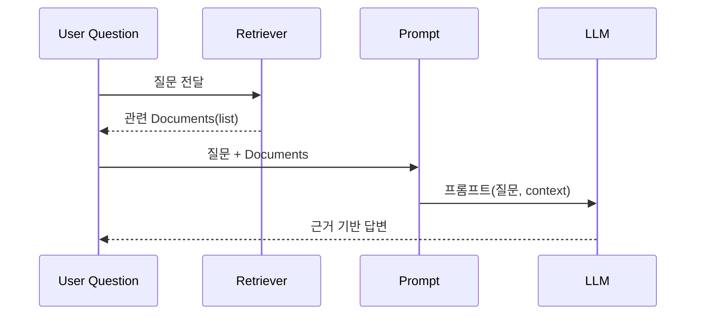

# RAG 프롬프팅 정리

## 핵심 개념
- Document: 검색·생성 파이프라인에서 다루는 최소 정보 단위. 필수 필드는 `page_content`, 선택 필드로 `metadata`에 출처/페이지 등 부가 정보를 담아 근거성을 높인다.
- Retriever: “질문 → 관련 Document 리스트”를 반환하는 어댑터. 벡터스토어, 키워드 검색, 정적 리스트, DB 조회 등 어떤 백엔드든 구현 가능하며, 저장소 그 자체가 아니라 조회 로직을 표준 인터페이스로 감싼 것.
- Vector store: Retriever가 자주 붙는 백엔드 유형 중 하나일 뿐, Retriever와 동일시되지 않는다.

## 코드 맥락 (`P2/2-rag.py`)
- `SimpleRetriever`는 고정된 한 개의 `Document`를 반환하는 최소 구현 예시.
- Runnable 파이프라인으로 질문 전달과 컨텍스트 검색을 한 번에 묶을 수 있다. 딕셔너리 입력을 쓸 땐 질문만 추출해 retriever에 넣어야 타입 오류를 피할 수 있다:

```python
from operator import itemgetter
from langchain_core.runnables import RunnablePassthrough

chain = {
    "context": itemgetter("question") | retriever,  # 질문만 뽑아서 검색
    "question": itemgetter("question"),             # 원본 질문 전달
} | prompt | llm

response = chain.invoke({"question": "한국의 대통령은?"})
print(response.content)
```

## 두 가지 흐름 비교
- 수동 호출: `context = retriever.invoke(q)` → `llm({"context": context, "question": q})`. 명시적이지만 단계가 분리됨.
- Runnable 파이프라인: 입력 한 번에 분기/병합이 이루어짐. 전처리나 후처리 runnable을 사이에 끼워 확장하기 쉽다.

## RAG 프롬프팅 절차(체크리스트)
1) Retriever 준비: 직접 구현하거나 `vectorstore.as_retriever()` 사용. 입력은 보통 문자열 질문.  
2) 체인 조합: `{ "context": retriever_or_pipe, "question": passthrough } | prompt | llm`.  
3) 컨텍스트 포맷터(선택): 상위 k개만 사용, 메타데이터 포함 방식 변경 등은 runnable로 삽입.  
4) 실행: `.invoke(question)` 또는 `.invoke({"question": question})`로 질문을 넣어 컨텍스트 검색 → 프롬프트 주입 → LLM 호출까지 일괄 수행.  
5) 품질 관리: 문서 chunk 크기/overlap, 메타데이터 필터, 임베딩 품질이 컨텍스트 적합도에 직접 영향.

## 시퀀스 다이어그램 (Mermaid UML)


